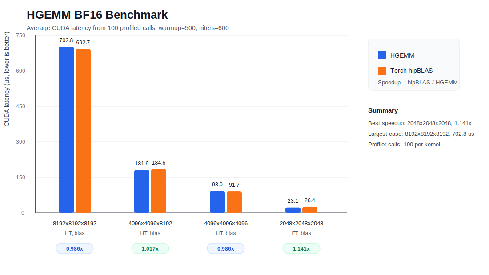

# FlyDSL Examples

Unofficial GEMM kernel examples built with [FlyDSL](https://github.com/ROCm/FlyDSL) for AMD GPUs.

The goal of this repository is to show how to write high-performance GEMM kernels from scratch in Python, while keeping the implementation close enough to the hardware to reason about tiling, memory movement, and WMMA/MFMA execution. The programming style is similar in spirit to CUDA/CuteDSL, but targets AMD GPUs through FlyDSL.

## Kernels

- [x] FP16/BF16 GEMM WMMA for MI350
- [x] FP8 PTPC GEMM WMMA for MI350

## Results



## Run Tests And Benchmarks

```bash
rm -rf ~/.flydsl/ ; pytest -sv test_hgemm.py
```

## Use code agent to scale the kernel to your hardware

```bash
python agent/agent.py --input=agent/instructions/flydsl_gemm_mi308_support.txt
```

## References

- [FlyDSL](https://github.com/ROCm/FlyDSL)
- [MLIR docs](https://mlir.llvm.org/docs/)
- [ROCm blog: Accelerating LLM inference on AMD GPUs with low-latency GEMMs](https://rocm.blogs.amd.com/software-tools-optimization/accelerating-llm-inference-on-amd-gpus-with-low-latency-gemms/README.html)

Contact: xytpai@gmail.com
