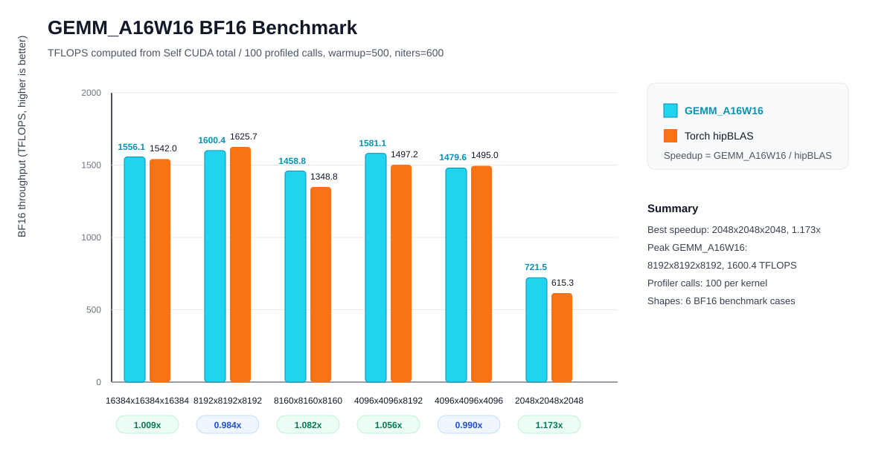

# FlyDSL GEMM Examples

Unofficial, hardware-oriented GEMM implementations built with
[FlyDSL](https://github.com/ROCm/FlyDSL) for AMD gfx950 GPUs.

This repository demonstrates how to write high-performance GPU kernels from
scratch in Python while keeping tiling, data movement, LDS usage, scheduling,
and MFMA execution explicit. The programming model is similar in spirit
to CUDA/CuTeDSL, but targets AMD GPUs through FlyDSL.



## Highlights

### A16W16 GEMM

`kernels/gemm_a16w16_gfx950.py` provides a layout-dynamic FP16/BF16 GEMM with:

- `NN`, `NT`, `TN`, and `TT` matrix layouts
- FP16 and BF16 inputs
- Input-dtype or FP32 output
- Optional bias
- Workgroup-local slice-K via `k_waves`
- Cross-workgroup split-K with atomic reduction
- K-tail and boundary-tile handling
- Small-M configurations
- Half-tile interleaved (HTI) scheduling
- Dynamic leading strides, padded strides, and storage offsets
- Configurable tiles, stages, wave decomposition, and XCD block swizzle

HTI currently requires `stages=2`, `m_waves=2`, and `k_waves=1`.
Inputs and dimensions must satisfy the kernel's vector-alignment constraints.

## Layout Convention

Layout characters describe physical tensor strides without changing logical
shapes:

- `N`: row-major storage
- `T`: column-major storage

For example, `layout="nt"` expects logical shapes `A[M, K]` and `B[K, N]`,
with A stored row-major and B stored column-major.

## Quick Start

```python
import torch

from kernels.gemm_a16w16_gfx950 import gemm_a16w16

m, n, k = 2048, 4096, 4096
a = torch.randn((m, k), device="cuda", dtype=torch.bfloat16)
b = torch.randn((n, k), device="cuda", dtype=torch.bfloat16).t()

c = gemm_a16w16(
    a,
    b,
    layout="nt",
    user_kwargs={
        "block_m": 128,
        "block_n": 256,
        "block_k": 64,
        "stages": 3,
        "split_k": 1,
        "m_waves": 4,
        "n_waves": 4,
        "k_waves": 1,
        "group_m": 4,
        "use_half_tile_interleaved": False,
    },
)
```

## Requirements

- Linux with ROCm
- AMD gfx950-class GPU
- ROCm-enabled PyTorch
- FlyDSL built from source

## Install FlyDSL from Source

The following revision is the version used by this repository:

```bash
pip uninstall -y flydsl
git clone git@github.com:ROCm/FlyDSL.git
cd FlyDSL
git checkout e338067610c0d420e63d4f36042987ad8c87841a
git submodule sync
git submodule update --init --recursive
bash scripts/build_llvm.sh -j32
bash scripts/build.sh -j64
pip install -e .
```

## Tests

Run the GEMM correctness suite:

```bash
pytest -sv test_gemm_a16w16_gfx950.py
```

Run a focused layout test:

```bash
pytest -sv test_gemm_a16w16_gfx950.py -k "main_loop and nt"
```

After changing FlyDSL compiler or kernel sources, clear the JIT cache when
needed:

```bash
rm -rf ~/.flydsl/cache
```

## Policy Tuning

Tune one shape:

```bash
python gemm_tune.py \
  --single \
  --dtype bf16 \
  --layout nt \
  --m 2048 \
  --n 4096 \
  --k 4096
```

Include split-K policies:

```bash
python gemm_tune.py \
  --single \
  --dtype bf16 \
  --layout nt \
  --m 32 \
  --n 384 \
  --k 7168 \
  --enable-split-k
```

Tune the built-in shape collection:

```bash
python gemm_tune.py \
  --tune_all \
  --dtype bf16 \
  --layout nt \
  --out temp/gemm_a16w16_tuned
```

The tuner validates each policy, compiles policies in parallel, benchmarks
successful candidates, and writes the selected configurations to JSONL.
Use `--compile-workers` to control policy compilation concurrency.

## PyTorch Backend Comparison

Compare ATen/hipBLAS, Triton, and FlyDSL through `torch.compile`:

```bash
python torch_benchmark.py \
  --backend all \
  --dtype bfloat16 \
  --output temp/torch_benchmark.jsonl
```

Use `--shape-index` to run a single built-in shape.

## Repository Structure

```text
kernels/
  gemm_a16w16_gfx950.py        # A16W16 GEMM
  gemm_a16w16_gfx950_utils.py  # Layout, LDS, split-K, and store helpers
test_gemm_a16w16_gfx950.py     # GEMM correctness and benchmarks
gemm_tune.py                    # Policy search and tuning
torch_benchmark.py              # torch.compile backend comparison
```

## References

- [FlyDSL](https://github.com/ROCm/FlyDSL)
- [MLIR documentation](https://mlir.llvm.org/docs/)
- [ROCm blog: Accelerating LLM inference on AMD GPUs with low-latency GEMMs](https://rocm.blogs.amd.com/software-tools-optimization/accelerating-llm-inference-on-amd-gpus-with-low-latency-gemms/README.html)

Contact: xytpai@gmail.com
