# LDS-Pipelined Split-K GEMM for LLM Decode on AMD GPUs

Large language model serving is becoming increasingly interactive. Users expect chatbots, coding assistants, agents, and real-time copilots to respond quickly, stream tokens smoothly, and stay responsive under concurrent load. In that setting, decode-time latency is not just a backend metric. It directly affects perceived quality.

This blog focuses on one small but important part of that problem: **decode-time GEMMs with small `M`, large `N/K`, BF16/FP16 inputs, optional bias, and shapes that repeat across real models**.

The algorithmic idea is **LDS-Pipelined Split-K GEMM**: the long `K` reduction is split across CTAs, further sliced across warp groups inside each CTA, and kept moving through a multi-stage LDS memory pipeline.

## TL;DR

Decode GEMM in LLM serving often has very small `M` and large `K`, which leaves conventional GEMM tiling short of parallel work. We propose **LDS-Pipelined Split-K**, a decode-focused GEMM optimization that combines **inter-CTA Split-K**, **intra-CTA K-slice splitting**, and a **multi-stage LDS pipeline**.

The result is a shape-specialized decode GEMM path optimized for the shapes that actually appear in serving: small `M`, large `K`, moderate-to-large `N`, BF16/FP16 inputs, optional bias, and repeated model projection sizes.

## The Scenario: Interactive LLM Decode

LLM serving has two broad phases:

1. **Prefill**, where the model processes the prompt.
2. **Decode**, where the model generates output tokens one step at a time.

Prefill often has a larger effective `M` because many prompt tokens can be processed together. Decode is different. Each step may only process a small number of active tokens, especially after batching, scheduling, tensor parallelism, and request-level dynamics are taken into account.

That makes decode performance important for user-facing latency:

- **Time to first token** affects how quickly the system appears to respond.
- **Time per output token** affects streaming smoothness.
- **Inter-token latency** affects whether the interaction feels fluid.
- **Throughput under concurrency** affects how many users can be served without hurting responsiveness.

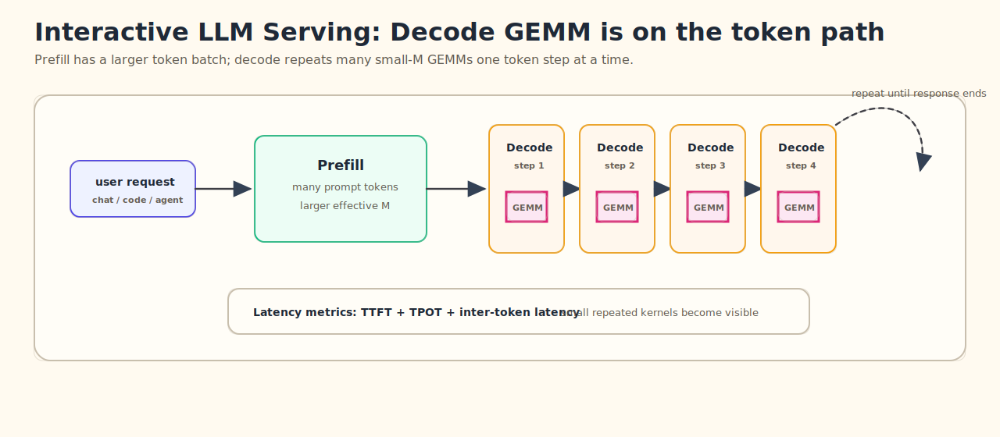

For these workloads, shaving overhead from repeated decode GEMMs can matter at the model-serving level.

## The Pain Point: Small-`M`, Large-`K` GEMM

In large-model decode, GEMM often looks like:

```text
C[M, N] = A[M, K] @ B[N, K]^T
```

Visually, the kernel still starts from the standard GEMM idea: compute a tile of `C` from a tile of `A` and a tile of `B`. The problem is that a small `M` produces too few output tiles, even though the `K` dimension can be very long.

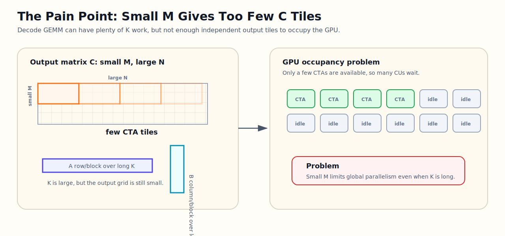

where `M` is the number of active tokens in a decode step or micro-batch. For serving workloads, `M` is frequently small: `1`, `2`, `4`, `8`, `16`, `32`, sometimes up to `128` or `256`. At the same time, `N` and `K` are model-hidden-size dimensions and can be thousands or tens of thousands.

That shape regime is awkward for general GEMM libraries. A conventional large-tile GEMM wants enough `M x N` work per block to keep all compute units busy. Decode GEMM often does not provide that naturally. The result is under-occupancy, poor wave utilization, and too much overhead relative to useful math.

---

## Why This Scenario Matters

The motivation came directly from model shape traces, not from synthetic square GEMMs.

Across current LLMs, decode GEMM shapes repeatedly show the same pattern:

| Model family | Typical decode GEMM pattern |
|---|---|
| DeepSeek V3 | `M = 1–256`, `N = 256 / 2112 / 3072 / 7168 / 16160`, `K = 1536 / 2048 / 7168` |
| GPT-OSS | `M = 1–256`, `N = 128 / 640 / 2560 / 2880 / 5120`, `K = 512 / 2048 / 2880 / 4096` |
| GLM5 | `M = 1–256`, plus prefill-like large `M`, with `N/K` around `6144`, `4096`, `2048`, etc. |
| Kimi K2 | many skinny decode shapes such as `M = 8–512`, `N = 384 or 1024`, `K = 7168` |
| Llama 70B / 450B | `M = 1–32768`, but decode-critical cases include `M = 1/16/32/64`, with large `N/K` |
| Qwen32B | `M = 1–32768`, with decode-heavy skinny projections such as `N = 100/200/800`, `K = 5120` |

The important observation is not just “small `M` exists.” It is that **small-`M`, large-`K` GEMMs occur everywhere in decode paths**, and they affect end-to-end serving throughput.

So the design target is:

```text
small M
large K
moderate-to-large N
BF16/FP16 input
BF16 output
optional bias
low launch overhead
good occupancy even when M is tiny
```

---

## Why Common GEMM Optimizations Are Not Enough

General GEMM optimization usually focuses on large matrix efficiency: bigger tiles, better memory coalescing, shared-memory staging, vectorized loads, MFMA/tensor-core utilization, pipelining, and occupancy tuning. These are all important, but decode GEMM adds a specific problem: the output tile grid may be too small because `M` is tiny.

| Common approach | Why it helps in general | Why it can struggle for decode GEMM |
|---|---|---|
| Large CTA tiles | Improves data reuse and arithmetic intensity | Small `M` may not provide enough independent tiles |
| Better global-memory coalescing | Reduces memory transaction waste | Does not by itself create more parallel work |
| LDS / shared-memory caching | Reuses A/B tiles across many operations | Helps the pipeline, but not global under-occupancy |
| MFMA-focused scheduling | Improves compute throughput | Needs enough active work to keep CUs busy |
| Split-K-style partitioning | Creates more CTAs along K | Each CTA may still have limited intra-block utilization |
| Slice-K-style partitioning | Uses more warp groups inside a CTA | Does not solve global under-occupancy when `M` is very small |

This is why LDS-Pipelined Split-K combines multiple forms of K parallelism. One layer increases global work across the GPU. Another increases useful work inside each CTA. A third keeps K blocks moving through a staged pipeline.

---

## In This Blog: LDS-Pipelined Split-K GEMM

We propose a decode-focused GEMM optimization that exposes the long `K` reduction as parallel work at three levels:

- **Inter-CTA Split-K** to increase global parallelism when the `M x N` tile grid is too small.
- **Intra-CTA K-Slice Split** to let multiple warp groups cooperate on K-heavy tiles.
- **Multi-stage LDS pipeline** to overlap global-to-LDS movement, LDS reads, and MFMA compute while K blocks are pipelined through the CTA.
- **LDS reduction** to combine intra-CTA K-slice partials locally.
- **Global atomic accumulation** to combine inter-CTA Split-K partials globally.
- **A lightweight signal/semaphore protocol** to keep the whole operation in one GEMM launch.

The optimization path is therefore to split the long `K` reduction through three cooperating layers: globally across CTAs, locally across warp groups, and temporally through a staged LDS memory/compute pipeline.

The figure below shows the algorithm from the matrix-tile point of view. A selected `C` tile is not produced by one monolithic CTA. Instead, the long `K` dimension is broken into Split-K ranges. Each range multiplies the matching `A` row tiles and `B^T` column tiles, produces a partial `C` tile, and then participates in the reduction path.

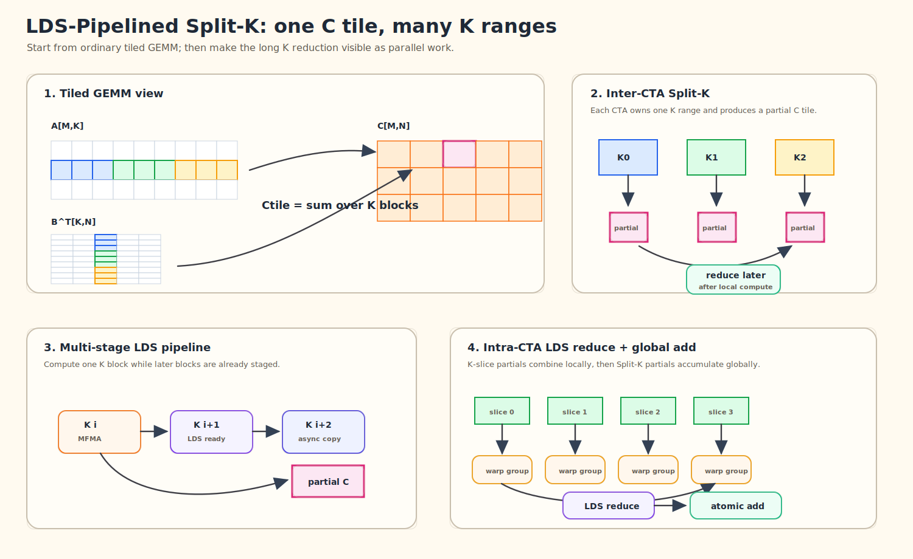

The rest of this blog focuses on the algorithmic flow first, then briefly shows how the design is implemented as a tunable kernel family.

## Key Contributions

This work combines several ideas into one decode-focused GEMM path:

1. **Hierarchical Split-K parallelism.**  
   Inter-CTA Split-K increases global parallelism, while intra-CTA K-slice splitting increases warp-group utilization for K-heavy tiles.

2. **Multi-stage LDS pipeline.**  
   The implementation streams K blocks through staged LDS buffers and schedules global loads, LDS reads, and MFMA work together.

3. **Single-launch Split-K synchronization.**  
   A lightweight `signal[]` / `semaphore[]` protocol initializes `C`, coordinates inter-CTA Split-K partitions, and resets state without a separate initialization kernel.

4. **LDS-based intra-CTA reduction.**  
   Warp-group partials are reduced in LDS before the tile is stored or globally accumulated.

5. **Shape-specialized kernel variants.**  
   Tile sizes, inter-CTA Split-K, intra-CTA K slicing, LDS policy, bias handling, dtype, and architecture paths are specialized per decode shape.

6. **Architecture-aware MFMA path.**  
   The kernel selects the appropriate BF16/FP16 MFMA path, including the newer `m16n16k32` path used for gfx950-style tuning.

---

## The Core Idea: LDS-Pipelined Split-K

The kernel treats `K` as splittable reduction work rather than a private serial loop inside one CTA. For one output tile `C[m_tile, n_tile]`, the computation is:

```text
C_tile =
    A[m_tile, K0] @ B^T[K0, n_tile]
  + A[m_tile, K1] @ B^T[K1, n_tile]
  + A[m_tile, K2] @ B^T[K2, n_tile]
  + ...
```

LDS-Pipelined Split-K exposes those `K0/K1/K2/...` chunks at three levels:

1. **Inter-CTA Split-K**: split the full K dimension across multiple CTAs / workgroups.
2. **Intra-CTA K-Slice Split**: split one CTA’s K tile across multiple warp groups inside the block.
3. **Multi-stage LDS pipeline**: pipeline K blocks through staged LDS buffers while overlapping global memory movement, LDS reads, and MFMA compute.

These layers solve different problems.

| Technique | Where it adds parallelism | What it helps | What it needs |
|---|---|---|---|
| Inter-CTA Split-K | Across CTAs / workgroups | Better GPU occupancy when `M x N` has too few tiles | Global accumulation and synchronization |
| Intra-CTA K-Slice Split | Inside one CTA | Better use of warp groups for K-heavy tiles | LDS staging and local reduction |
| Multi-stage LDS pipeline | Across time inside a CTA | Overlap loading, LDS reads, and MFMA while K blocks advance | Staged LDS buffers and scheduling |
| LDS-Pipelined Split-K | All three levels | More work across the GPU, more useful work per CTA, and smoother K-block pipelining | A coordinated reduction and pipeline path |

### Inter-CTA Split-K: More CTAs for Small-M GEMM

When `M` is small, the normal `M x N` tile grid may not launch enough CTAs to saturate the GPU.

Inter-CTA Split-K expands the grid along K:

```text
grid = [M/N tiles, split_k]
```

Each Split-K partition computes a partial sum over a different K range. The partial results are accumulated into the same output tile.

In the launch wrapper, inter-CTA Split-K is visible as the second grid dimension:

```python
bm = (m + BLOCK_M - 1) // BLOCK_M
hgemm_kernel(C, A, B, BIAS, m, semaphore, signal).launch(
    grid=(bm * N_BLOCKS, SPLIT_K, 1),
    block=(BLOCK_THREADS, 1, 1),
    stream=stream,
)
```

This is especially useful for decode shapes like:

```text
M = 1, 2, 4, 8, 16
N = 2560 / 2880 / 5120
K = 2880 / 4096 / 7168
```

Without this extra Split-K dimension, there may simply not be enough independent work.

### Intra-CTA K-Slice Split: More Warp-Group Parallelism

Inter-CTA Split-K increases the number of CTAs. Intra-CTA K-Slice Split increases useful work inside one CTA.

The kernel assigns multiple warp groups to different K slices of the same tile. Each group computes a partial accumulation. At the end of the CTA, those partial results are reduced through LDS before writing back.

This helps in two ways:

- It increases parallelism for K-heavy tiles.
- It controls register pressure by distributing work across warp groups.

### Multi-Stage LDS Pipeline

The third layer is temporal. Once a CTA owns a K range, it still has to repeatedly compute:

```text
C_tile += A[m_tile, K_i] @ B^T[K_i, n_tile]
```

for many consecutive `K_i` blocks. Instead of treating those blocks as a serial load-then-compute sequence, the kernel keeps several `K_i` blocks in flight at the same time: one block is consumed by MFMA, the next block is already ready in LDS, and a later block is being copied from global memory.

In the `B_TO_LDS` path, the hot loop keeps a rolling set of stages:

```python
for s in range_constexpr(STAGES - 1):
    ldg_sts_b_async(ks_begin + s * BLOCK_K, s)
    ldg_sts_a_async(ks_begin + s * BLOCK_K, s)

for bki, state in range(0, BLOCK_K_LOOPS - (STAGES - 1), 1, init=init_state):
    k_offset = state[0]
    current_stage = fx.Index(state[1])
    next_stage = (current_stage + 1) % STAGES
    write_stage = (current_stage + STAGES - 1) % STAGES

    __barrier((STAGES - 2) * LDG_WAIT_COUNT)
    ldg_sts_b_async(k_offset + (STAGES - 1) * BLOCK_K, write_stage)
    ldg_sts_a_async(k_offset + (STAGES - 1) * BLOCK_K, write_stage)
    c_frags_new = ldmatrix_compute_tile_streaming(current_stage, c_frags)
    hot_loop_scheduler()
```

Conceptually:

```text
stage t      : MFMA consumes K block i
stage t + 1  : LDS has K block i + 1 ready
stage t + 2  : async copy brings K block i + 2
```

The scheduler hints in `hot_loop_scheduler()` order VMEM, LDS reads, and MFMA instructions so the staged K pipeline keeps moving through the CTA.

### Why Mix Them?

For decode GEMM, no single layer is sufficient.

- Inter-CTA Split-K gives more CTAs, but each CTA may still be inefficient.
- Intra-CTA K-Slice Split improves block-level utilization, but cannot fix global under-occupancy when `M` is tiny.
- Multi-stage LDS pipeline keeps K-block movement and MFMA compute overlapped, but it needs enough global and local parallel work to matter.
- Combining them gives:
  - more CTAs across the GPU,
  - more useful warp-group work inside each CTA,
  - a K-block pipeline that keeps memory movement and compute coordinated.

That is the reason for the LDS-Pipelined Split-K design.

---

## Single-Launch Split-K Synchronization

Inter-CTA Split-K creates a correctness problem: multiple CTAs contribute to the same output tile.

This kernel uses a lightweight global synchronization protocol with two global buffers:

```text
signal[]
semaphore[]
```

The flow is:

1. The first Split-K partition initializes the output tile.
   - If bias is enabled, it writes bias into `C`.
   - Otherwise, it zeroes `C`.

2. After initialization, it writes a `signal`.

3. Other Split-K partitions spin-wait on that signal before accumulating.

4. Each Split-K partition computes its partial result.

5. The partial result is accumulated into global `C` with atomic add.

6. A semaphore counts how many Split-K partitions have arrived.

7. The last arriving partition resets both `signal` and `semaphore`.

Conceptually:

```text
Split-K group:
    partition 0:
        initialize C
        signal ready

    all partitions:
        wait until C is ready
        compute partial C
        atomic_add partial into C

    last partition:
        reset synchronization state
```

The same flow can be viewed as a small protocol among the inter-CTA Split-K partitions:

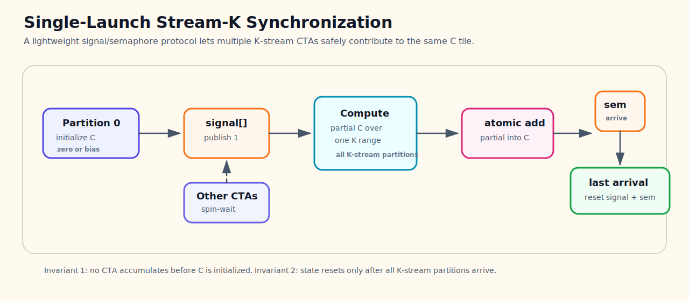

This avoids a separate initialization kernel and keeps the entire operation inside one GEMM launch.

That matters for decode, where launch overhead and small-kernel overhead are visible at the model level.

The protocol relies on two simple correctness invariants:

1. **No Split-K partition accumulates into `C` before initialization is visible.**  
   Partition 0 initializes the output tile and publishes `signal = 1`; the other partitions spin-wait on that signal before doing global atomic accumulation.

2. **Synchronization state is reset only after all Split-K partitions arrive.**  
   Each partition increments `semaphore[]`; the last arriving partition resets both `signal[]` and `semaphore[]` for reuse.

In the implementation, the protocol stays close to the algorithm. Partition 0 initializes `C` and publishes the signal:

```python
if const_expr(IS_SPLIT_K):
    zero_c()

# inside zero_c()
signal_ptr = get_llvm_ptr(signal, signal_idx, 4)
llvm.InlineAsmOp(
    None,
    [signal_ptr, arith.constant(1, type=T.i32)],
    "global_store_dword $0, $1, off sc0 sc1",
    "v,v",
    has_side_effects=True,
)
```

Every Split-K partition later enters the barrier, increments the semaphore, and the last partition clears the state:

```python
arrive_idx = llvm.AtomicRMWOp(
    llvm.AtomicBinOp.add,
    semaphore_ptr,
    arith.constant(1, type=T.i32),
    llvm.AtomicOrdering.monotonic,
    syncscope="agent",
    alignment=4,
).result

cond_ksl = arith.cmpi(
    arith.CmpIPredicate.eq,
    fx.Index(arrive_idx),
    fx.Index(SPLIT_K - 1),
)
cond_ksl_if = scf.IfOp(cond_ksl, results_=[], has_else=False)
with ir.InsertionPoint(cond_ksl_if.then_block):
    semaphore_[signal_idx] = arith.constant(0, type=T.i32)
    signal_[signal_idx] = arith.constant(0, type=T.i32)
```

---

## LDS Reduction for Intra-CTA K-Slice Split

Intra-CTA K-Slice Split happens inside a CTA.

Each K-slice warp group produces partial `C` fragments. Instead of immediately writing each partial to global memory, the kernel stages the partial results through LDS:

```text
partial C from slice 0
partial C from slice 1
...
partial C from slice K
        ↓
LDS reduction
        ↓
global store or global atomic
```

When inter-CTA Split-K is disabled, the CTA reduces local K-slice partials and stores the final result.

When inter-CTA Split-K is enabled, the CTA first reduces its local K-slice partials, then participates in the global accumulation.

So the full reduction hierarchy is:

```text
MFMA fragments
    → per-warp accumulation
        → intra-CTA K-slice reduction in LDS
            → inter-CTA Split-K accumulation through global atomic
```

This hierarchy is the key design choice.

The implementation makes this hierarchy explicit by giving LDS `C` storage an extra `BLOCK_K_WARPS` dimension:

```python
smem_c_ptr = SmemPtr(
    base_ptr,
    smem_a_offset,
    dtype_,
    shape=(BLOCK_K_WARPS * BLOCK_M * BLOCK_N,),
)
cs_ = STensor(smem_c_ptr, dtype_, shape=(BLOCK_K_WARPS, BLOCK_M, BLOCK_N))
```

Each warp group writes its own K-slice partial into `cs_[wid_k, ...]`. The epilogue then reduces those partials before either storing the tile or participating in inter-CTA Split-K atomic accumulation:

```python
vec = cs_.vec_load((0, m_local_idx, n_local_idx), LDG_VEC_SIZE)
for ksi in range_constexpr(1, BLOCK_K_WARPS):
    vec += cs_.vec_load((ksi, m_local_idx, n_local_idx), LDG_VEC_SIZE)
```

---

## Multi-Stage LDS Memory Pipeline

The memory pipeline is easiest to understand from the same tiled-GEMM view. For one selected output tile, the CTA walks through a stream of K blocks:

```text
C_tile =
    A_i   @ B_i^T
  + A_i+1 @ B_i+1^T
  + A_i+2 @ B_i+2^T
  + ...
```

The multi-stage pipeline does not change this math. It changes **where each K block is while the loop is running**. At a given moment, `K_i` may be feeding MFMA, `K_i+1` may already be staged in LDS, and `K_i+2` may be arriving from global memory.

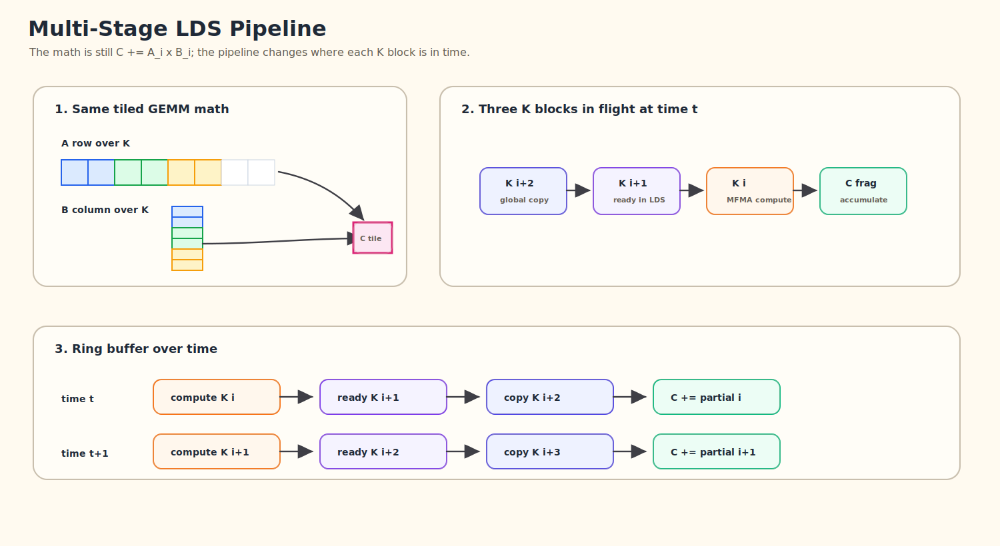

The kernel uses a conventional high-performance GEMM pipeline, but tuned for skinny decode shapes:

- A is staged through LDS.
- B can either be loaded directly or staged through LDS depending on tuning.
- Global-to-LDS async copy is used on newer architectures.
- LDS layout uses XOR swizzling to reduce bank conflicts.
- MFMA instructions compute FP32 accumulators from BF16/FP16 inputs.
- The epilogue converts to BF16/FP16 output.
- Bias can be fused into initialization or final store.

The kernel supports two MFMA paths:

| Architecture path | MFMA shape |
|---|---|
| gfx942-style path | `m16n16k16` |
| newer path, e.g. gfx950 | `m16n16k32` |

For decode tuning on gfx950, the `m16n16k32` BF16/FP16 path is the main target.

---

## Implementation Notes: From Algorithm to Kernel

LDS-Pipelined Split-K is not one fixed kernel. It is a family of specialized kernels whose best configuration depends on shape, dtype, bias, and GPU architecture.

The algorithm has low-level pieces: MFMA selection, LDS allocation, async copies, global atomics, `s_waitcnt`, barriers, and inline assembly for specific global memory operations. The implementation keeps those details explicit so the kernel can specialize the tile shape, Split-K factor, memory path, and epilogue together.

In `splitk_hgemm.py`, the kernel family is parameterized directly in the builder:

```python
@functools.lru_cache(maxsize=1024)
def compile_hgemm_kernel(
    dtype: str,
    n: int,
    k: int,
    TILE_M: int = 128,
    TILE_N: int = 128,
    TILE_K: int = 64,
    STAGES: int = 2,
    SPLIT_K: int = 1,
    BLOCK_M_WARPS: int = 2,
    BLOCK_N_WARPS: int = 2,
    BLOCK_K_WARPS: int = 1,
    B_TO_LDS: bool = False,
    HAS_BIAS: bool = False,
):
    IS_SPLIT_K = SPLIT_K > 1
    IS_SLICE_K = BLOCK_K_WARPS > 1
```

Those parameters are the tuning surface:

```text
TILE_M / TILE_N / TILE_K  -> CTA tile shape
SPLIT_K                  -> global K parallelism across CTAs
BLOCK_K_WARPS            -> intra-CTA K-slice parallelism
B_TO_LDS                 -> whether B is staged through LDS
HAS_BIAS                 -> fused bias path
dtype + GPU_ARCH         -> MFMA instruction selection
```

For example, architecture selection becomes ordinary Python control flow around ROCm intrinsics:

```python
GPU_ARCH = get_rocm_arch()
if GPU_ARCH == "gfx942":
    WMMA_IMPL = WmmaHalf_m16n16k16(dtype)
    DMA_BYTES = 4
    MFMA_PER_WARP_K = 2
else:
    WMMA_IMPL = WmmaHalf_m16n16k32(dtype)
    DMA_BYTES = 16
    MFMA_PER_WARP_K = 1
```

The MFMA path itself is still explicit:

```python
class WmmaHalf_m16n16k32(WmmaHalfBase):
    WMMA_M = 16
    WMMA_N = 16
    WMMA_K = 32

    def __call__(self, a_frag, b_frag, c_frag):
        if self.dtype == "bf16":
            return rocdl.mfma_f32_16x16x32_bf16(
                T.vec(self.WMMA_C_FRAG_VALUES, T.f32),
                [a_frag, b_frag, c_frag, 0, 0, 0],
            )
        return rocdl.mfma_f32_16x16x32_f16(
            T.vec(self.WMMA_C_FRAG_VALUES, T.f32),
            [a_frag, b_frag, c_frag, 0, 0, 0],
        )
```

The result is a useful middle ground:

1. **The kernel is generated as a family of specialized kernels.**  
   Each shape can JIT to the right tile, inter-CTA Split-K factor, intra-CTA K slicing, LDS policy, MFMA path, and bias path.

2. **The synchronization logic stays connected to the algorithm.**  
   Split-K initialization, signal wait, semaphore reset, LDS reduction, and epilogue logic are written in one kernel instead of being scattered across several auxiliary launches.

3. **The compiler can specialize aggressively.**  
   Branches like `HAS_BIAS`, `B_TO_LDS`, `SPLIT_K > 1`, `BLOCK_K_WARPS > 1`, and architecture-specific MFMA paths become compile-time constants.

4. **Tuning moves faster than hand-written assembly iteration.**  
   For model-serving kernels, this matters. We need to test many real model shapes, not just one benchmark shape.

In other words, the implementation strategy matters because the algorithm needs many tuned variants, not one universal kernel.

---

## Where This Design Helps

This design is aimed at decode GEMM shapes where the output tile grid alone does not expose enough parallel work.

The expected winning region follows directly from the design:

```text
small M
large K
moderate or large N
```

That is where the normal `M x N` tile grid is too small to keep the GPU busy, and where additional K parallelism can help. Inter-CTA Split-K increases global work across CTAs. Intra-CTA K-Slice Split improves warp-group utilization. The multi-stage LDS pipeline keeps K blocks moving through memory and compute. The signal/semaphore protocol and LDS reduction make these layers compose inside one GEMM launch.

The design is intentionally shape-specialized. It is strongest when small `M` limits occupancy and large `K` gives useful reduction work to split. It is less about replacing every GEMM path and more about making the decode-heavy path explicit, tunable, and maintainable.

---

## Benchmark Results

We evaluate LDS-Pipelined Split-K as a concrete BF16/FP16 GEMM kernel family on representative decode GEMM shapes. The data below uses `K = 7168`, `gfx950`, `256` CUs, and compares four backend paths:

- `Torch native`
- `Triton`
- `Tuned ASM`
- `LDS-Pipelined Split-K`

In the figures, `LDS-SK` is the compact label for LDS-Pipelined Split-K.

The main view is a visual speedup table. Each cell corresponds to one `(M, N, K)` shape. The large number is the speedup of LDS-Pipelined Split-K against the faster generic backend, and the small text shows the two measured latencies.

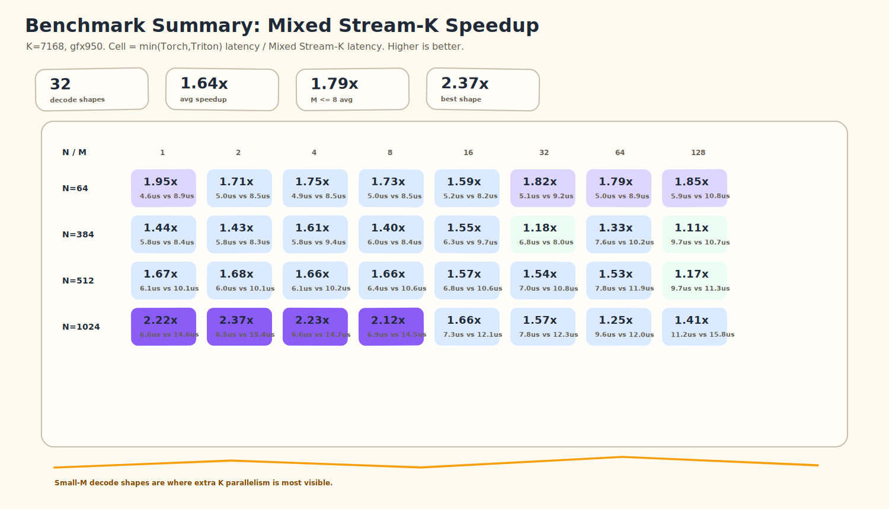

For each `(M, N, K)` shape, the baseline is the faster of `Torch native` and `Triton`, and the cell value is:

```text
speedup = min(torch_latency, triton_latency) / lds_pipelined_splitk_latency
```

Across these 32 decode GEMM shapes, LDS-Pipelined Split-K improves the average latency against the faster generic backend by about `1.64x`. For the most decode-sensitive region, `M <= 8`, the average speedup is about `1.79x`, with the best observed shape reaching about `2.37x`.

Compared with the tuned ASM path, LDS-Pipelined Split-K is also competitive across the sweep: the average speedup is about `1.44x`, with a best observed speedup around `1.97x`. A few shapes remain close, which is expected because the best backend depends on the exact `(M, N, K)` tile geometry and reduction balance.

The next table shows the fastest backend for each shape directly. This is useful as a sanity check because it answers a simpler question: which path wins this shape?

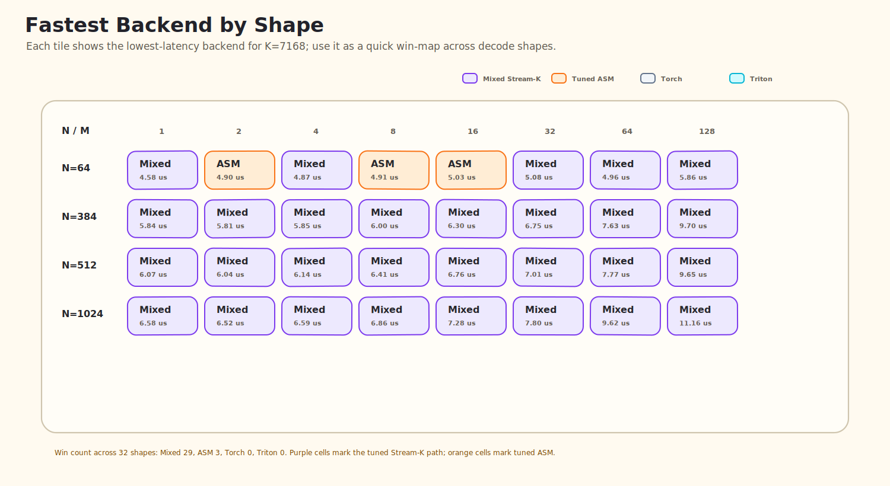

For readers who want to inspect the raw latency trend, the curve view below keeps the original backend-by-backend comparison. Each panel fixes `N`, while the x-axis changes `M` from `1` to `128`.

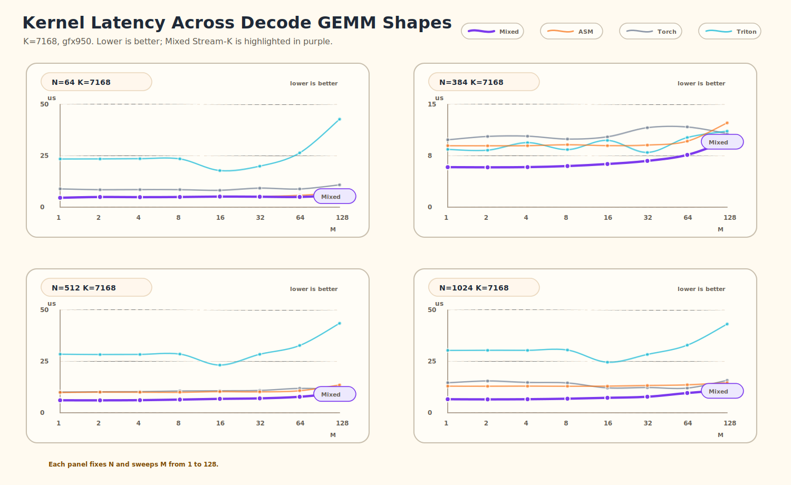

The same benchmark data also includes an additional BF16 model-shape sweep beyond the regular `K = 7168` grid. These shapes cover projection sizes such as `N = 128`, `640`, `2112`, `2880`, `5120`, and `7168`, with both bias and no-bias cases. The view below keeps the same visual convention, but groups rows by `(N, K, bias)`.

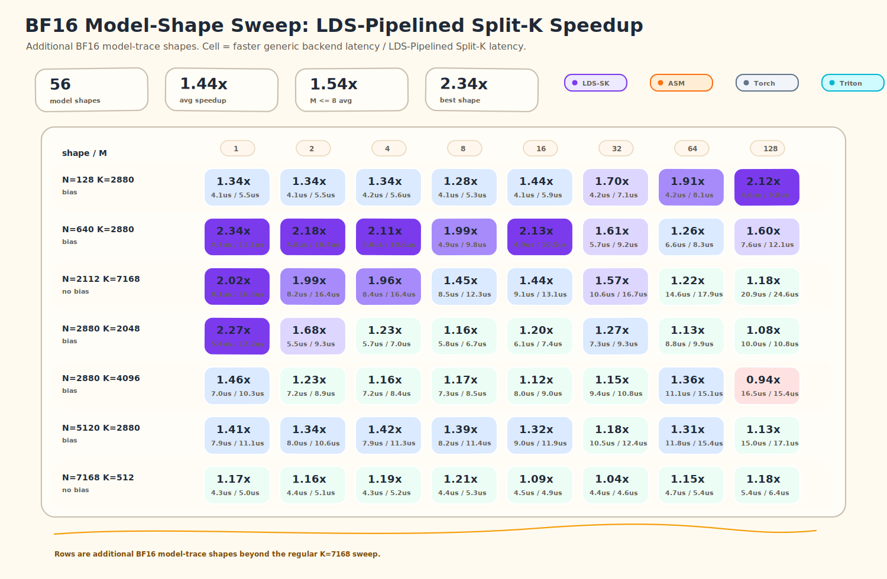

Across these 56 additional model-shape GEMMs, LDS-Pipelined Split-K improves the average latency against the faster generic backend by about `1.44x`. For `M <= 8`, the average speedup is about `1.54x`, with the best observed shape reaching about `2.34x`.

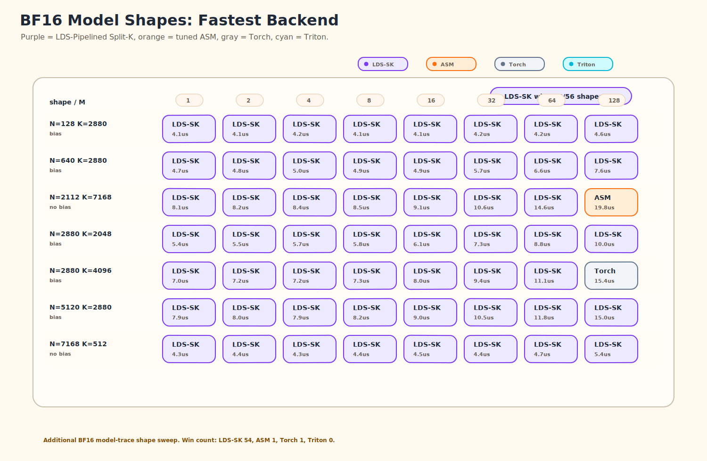

For raw latency comparison, the curve view fixes one model-shape family per panel and sweeps `M` from `1` to `128`.

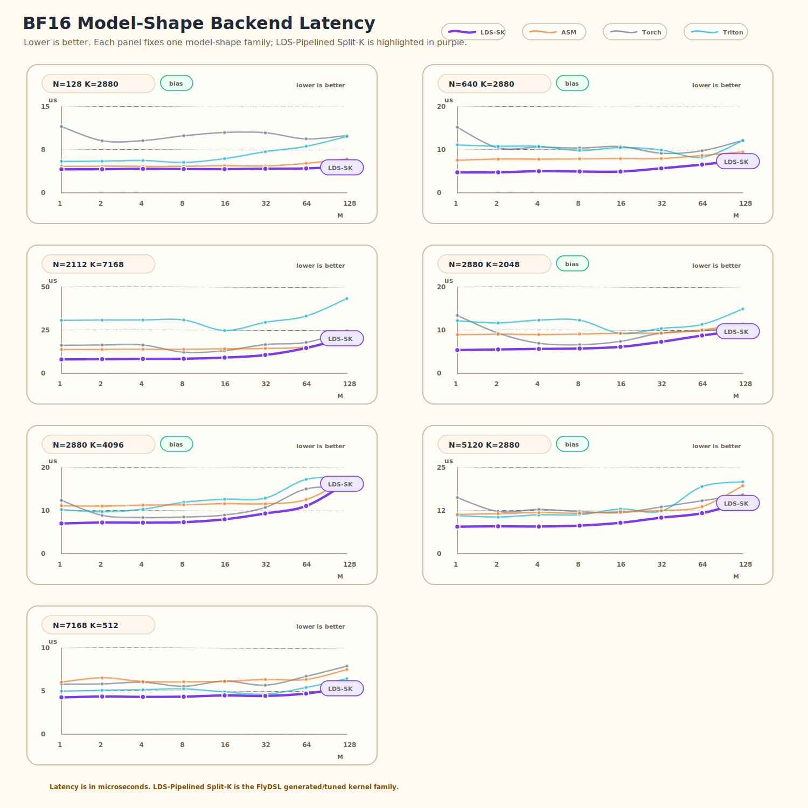

The important benchmark question is not “does this kernel win every GEMM?” The right question is: **does LDS-Pipelined Split-K improve the decode-heavy GEMMs that matter for interactive serving?**

---

## Design Takeaways

The main lessons are:

1. **Decode GEMM is not square GEMM.**  
   Optimizing for peak TFLOPS on large square matrices misses the serving bottleneck.

2. **Shape specialization changes the optimization loop.**  
   The kernel is treated as a parameterized family, then specialized by shape, dtype, bias, and architecture.

3. **Small `M` needs more parallelism.**  
   Inter-CTA Split-K increases global work when the `M x N` tile grid is too small.

4. **K-heavy tiles need better intra-block utilization.**  
   Intra-CTA K-Slice Split lets multiple warp groups cooperate on one output tile.

5. **The Split-K and LDS pipeline layers compose.**  
   Inter-CTA Split-K handles GPU occupancy; intra-CTA K-slice splitting handles block-level parallelism and register pressure; the multi-stage LDS pipeline keeps K blocks flowing.

6. **Synchronization must be integrated into the kernel.**  
   The signal/semaphore protocol avoids separate initialization kernels and keeps decode overhead low.

7. **Shape-specialized generation matters.**  
   Real model traces need many tuned variants, not one hand-picked configuration.

8. **The right answer is specialization, not one universal kernel.**  
   Decode-heavy shapes deserve targeted kernels whose tile shape, K parallelism, memory pipeline, and epilogue are tuned together.

---

## Summary

This is a GEMM optimization for the real shape distribution of LLM decode: small `M`, large `K`, BF16/FP16 inputs, optional bias, and many repeated model-specific projection sizes.

The key design is a three-layer Split-K plus LDS-pipeline strategy:

```text
Inter-CTA Split-K across CTAs
Intra-CTA K-Slice Split inside each CTA
Multi-stage LDS pipeline through LDS and MFMA
```

with a lightweight global signal/semaphore protocol for inter-CTA correctness and LDS-based partial reduction for intra-CTA K slices.

The key point for a serving stack is that decode-heavy shapes need targeted kernels, not a single universal GEMM path.

The point is not to chase peak TFLOPS. The point is to make the GEMMs that actually appear in LLM decode run faster.  
That is where this kernel wins.