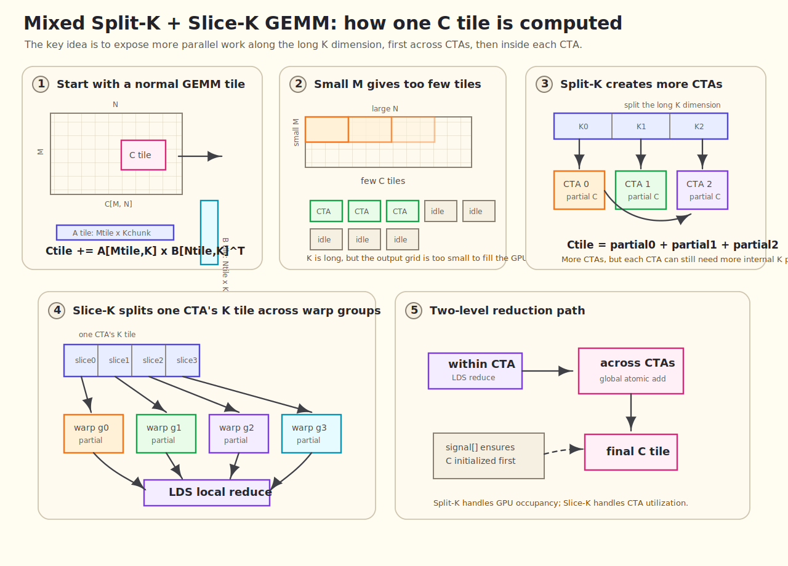
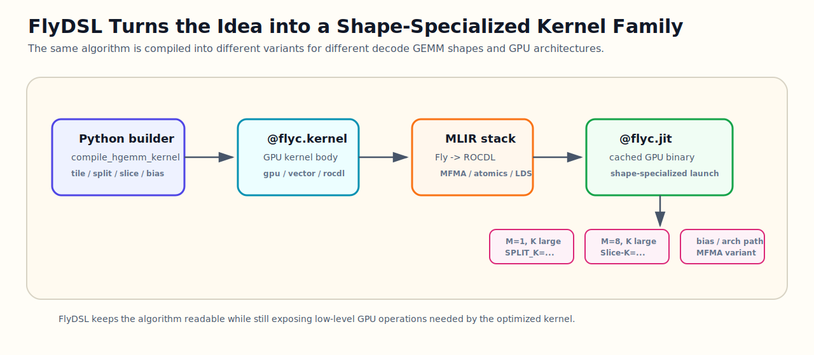

# Mixed Split-K + Slice-K GEMM for LLM Decode on AMD GPUs

Large language model serving is becoming increasingly interactive. Users expect chatbots, coding assistants, agents, and real-time copilots to respond quickly, stream tokens smoothly, and stay responsive under concurrent load. In that setting, decode-time latency is not just a backend metric. It directly affects perceived quality.

This blog focuses on one small but important part of that problem: **decode-time GEMMs with small `M`, large `N/K`, BF16/FP16 inputs, optional bias, and shapes that repeat across real models**.

The optimization is built with **FlyDSL**, a Python DSL and MLIR-based compiler stack for writing high-performance GPU kernels with explicit layouts, tiling, data movement, synchronization, and architecture-specific intrinsics. The algorithmic idea is a **mixed Split-K + Slice-K GEMM**: Split-K creates more global work across CTAs, while Slice-K creates more useful work inside each CTA.

## TL;DR

Decode GEMM in LLM serving often has very small `M` and large `K`, which leaves conventional GEMM tiling short of parallel work. We propose a FlyDSL-based GEMM optimization that combines **Split-K** across CTAs and **Slice-K** inside a CTA. FlyDSL makes the design practical by expressing the kernel as a family of shape-specialized variants rather than one fixed implementation.

The result is a FlyDSL-driven decode GEMM path optimized for the shapes that actually appear in serving, with the algorithm and the DSL working together: Split-K/Slice-K provide the parallelism strategy, while FlyDSL provides the specialization and tuning framework.

## The Scenario: Interactive LLM Decode

LLM serving has two broad phases:

1. **Prefill**, where the model processes the prompt.
2. **Decode**, where the model generates output tokens one step at a time.

Prefill often has a larger effective `M` because many prompt tokens can be processed together. Decode is different. Each step may only process a small number of active tokens, especially after batching, scheduling, tensor parallelism, and request-level dynamics are taken into account.

That makes decode performance important for user-facing latency:

- **Time to first token** affects how quickly the system appears to respond.
- **Time per output token** affects streaming smoothness.
- **Inter-token latency** affects whether the interaction feels fluid.
- **Throughput under concurrency** affects how many users can be served without hurting responsiveness.


For these workloads, shaving overhead from repeated decode GEMMs can matter at the model-serving level.

## The Pain Point: Small-`M`, Large-`K` GEMM

In large-model decode, GEMM often looks like:

```text
C[M, N] = A[M, K] @ B[N, K]^T
```

Visually, the kernel still starts from the standard GEMM idea: compute a tile of `C` from a tile of `A` and a tile of `B`. The problem is that a small `M` produces too few output tiles, even though the `K` dimension can be very long.


where `M` is the number of active tokens in a decode step or micro-batch. For serving workloads, `M` is frequently small: `1`, `2`, `4`, `8`, `16`, `32`, sometimes up to `128` or `256`. At the same time, `N` and `K` are model-hidden-size dimensions and can be thousands or tens of thousands.

That shape regime is awkward for general GEMM libraries. A conventional large-tile GEMM wants enough `M x N` work per block to keep all compute units busy. Decode GEMM often does not provide that naturally. The result is under-occupancy, poor wave utilization, and too much overhead relative to useful math.

---

## Why This Scenario Matters

The motivation came directly from model shape traces, not from synthetic square GEMMs.

Across current LLMs, decode GEMM shapes repeatedly show the same pattern:

| Model family | Typical decode GEMM pattern |
|---|---|
| DeepSeek V3 | `M = 1–256`, `N = 256 / 2112 / 3072 / 7168 / 16160`, `K = 1536 / 2048 / 7168` |
| GPT-OSS | `M = 1–256`, `N = 128 / 640 / 2560 / 2880 / 5120`, `K = 512 / 2048 / 2880 / 4096` |
| GLM5 | `M = 1–256`, plus prefill-like large `M`, with `N/K` around `6144`, `4096`, `2048`, etc. |
| Kimi K2 | many skinny decode shapes such as `M = 8–512`, `N = 384 or 1024`, `K = 7168` |
| Llama 70B / 450B | `M = 1–32768`, but decode-critical cases include `M = 1/16/32/64`, with large `N/K` |
| Qwen32B | `M = 1–32768`, with decode-heavy skinny projections such as `N = 100/200/800`, `K = 5120` |

The important observation is not just “small `M` exists.” It is that **small-`M`, large-`K` GEMMs occur everywhere in decode paths**, and they affect end-to-end serving throughput.

So the design target is:

```text
small M
large K
moderate-to-large N
BF16/FP16 input
BF16 output
optional bias
low launch overhead
good occupancy even when M is tiny
```

---

## Why Common GEMM Optimizations Are Not Enough

General GEMM optimization usually focuses on large matrix efficiency: bigger tiles, better memory coalescing, shared-memory staging, vectorized loads, MFMA/tensor-core utilization, pipelining, and occupancy tuning. These are all important, but decode GEMM adds a specific problem: the output tile grid may be too small because `M` is tiny.

| Common approach | Why it helps in general | Why it can struggle for decode GEMM |
|---|---|---|
| Large CTA tiles | Improves data reuse and arithmetic intensity | Small `M` may not provide enough independent tiles |
| Better global-memory coalescing | Reduces memory transaction waste | Does not by itself create more parallel work |
| LDS / shared-memory caching | Reuses A/B tiles across many operations | Helps the pipeline, but not global under-occupancy |
| MFMA-focused scheduling | Improves compute throughput | Needs enough active work to keep CUs busy |
| Split-K alone | Creates more CTAs along K | Each CTA may still have limited intra-block utilization |
| Slice-K alone | Uses more warp groups inside a CTA | Does not solve global under-occupancy when `M` is very small |

This is why we use both Split-K and Slice-K together. One increases global work across the GPU. The other increases useful work inside each CTA.

---

## In This Blog: A Mixed Split-K + Slice-K GEMM

We propose a decode-focused GEMM optimization that combines two levels of K parallelism:

- **Split-K across CTAs** to increase global parallelism when the `M x N` tile grid is too small.
- **Slice-K inside a CTA** to let multiple warp groups cooperate on K-heavy tiles.
- **LDS reduction** to combine Slice-K partials locally.
- **Global atomic accumulation** to combine Split-K partials globally.
- **A lightweight signal/semaphore protocol** to keep the whole operation in one GEMM launch.

The optimization path is therefore to split the long `K` dimension at two levels: globally across CTAs and locally inside each CTA.



The rest of this blog explains how the method works and how FlyDSL lets us turn it into a tunable kernel family.

## Key Contributions

This work combines several ideas into one decode-focused GEMM path:

1. **Mixed K parallelism.**  
   Split-K increases global parallelism across CTAs, while Slice-K increases intra-CTA parallelism for K-heavy tiles.

2. **Single-launch Split-K synchronization.**  
   A lightweight `signal[]` / `semaphore[]` protocol initializes `C`, coordinates Split-K partitions, and resets state without a separate initialization kernel.

3. **LDS-based Slice-K reduction.**  
   Warp-group partials are reduced in LDS before the tile is stored or globally accumulated.

4. **FlyDSL-based kernel specialization.**  
   The GEMM is written as a parameterized FlyDSL kernel family, so tile sizes, Split-K, Slice-K, LDS policy, bias handling, dtype, and architecture paths can be specialized per shape.

5. **Architecture-aware MFMA path.**  
   The kernel selects the appropriate BF16/FP16 MFMA path, including the newer `m16n16k32` path used for gfx950-style tuning.

---

## The Core Idea: Combine Split-K and Slice-K

The kernel uses two related but different forms of K parallelism:

1. **Split-K**: split the full K dimension across multiple CTAs / workgroups.
2. **Slice-K**: split one CTA’s K tile across multiple warp groups inside the block.

They solve different problems.

| Technique | Where it adds parallelism | What it helps | What it needs |
|---|---|---|---|
| Split-K | Across CTAs / workgroups | Better GPU occupancy when `M x N` has too few tiles | Global accumulation and synchronization |
| Slice-K | Inside one CTA | Better use of warp groups for K-heavy tiles | LDS staging and local reduction |
| Mixed Split-K + Slice-K | Both levels | More work across the GPU and more useful work per CTA | A two-level reduction path |

### Split-K: More CTAs for Small-M GEMM

When `M` is small, the normal `M x N` tile grid may not launch enough CTAs to saturate the GPU.

Split-K expands the grid along K:

```text
grid = [M/N tiles, split_k]
```

Each Split-K block computes a partial sum over a different K range. The partial results are accumulated into the same output tile.

In the FlyDSL launch wrapper, Split-K is visible as the second grid dimension:

```python
bm = (m + BLOCK_M - 1) // BLOCK_M
hgemm_kernel(C, A, B, BIAS, m, semaphore, signal).launch(
    grid=(bm * N_BLOCKS, SPLIT_K, 1),
    block=(BLOCK_THREADS, 1, 1),
    stream=stream,
)
```

This is especially useful for decode shapes like:

```text
M = 1, 2, 4, 8, 16
N = 2560 / 2880 / 5120
K = 2880 / 4096 / 7168
```

Without Split-K, there may simply not be enough independent work.

### Slice-K: More Intra-CTA Parallelism

Split-K increases the number of CTAs. Slice-K increases useful work inside one CTA.

The kernel assigns multiple warp groups to different K slices of the same tile. Each group computes a partial accumulation. At the end of the CTA, those partial results are reduced through LDS before writing back.

This helps in two ways:

- It increases parallelism for K-heavy tiles.
- It controls register pressure by distributing work across warp groups.

### Why Mix Them?

For decode GEMM, neither technique alone is sufficient.

- Split-K alone gives more CTAs, but each CTA may still be inefficient.
- Slice-K alone improves intra-block work, but cannot fix global under-occupancy when `M` is tiny.
- Combining them gives both:
  - more CTAs across the GPU,
  - more useful parallelism inside each CTA.

That is the reason for the mixed Split-K + Slice-K design.

---

## The Synchronization Problem

Split-K creates a correctness problem: multiple CTAs contribute to the same output tile.

This kernel uses a lightweight global synchronization protocol with two global buffers:

```text
signal[]
semaphore[]
```

The flow is:

1. The first Split-K partition initializes the output tile.
   - If bias is enabled, it writes bias into `C`.
   - Otherwise, it zeroes `C`.

2. After initialization, it writes a `signal`.

3. Other Split-K partitions spin-wait on that signal before accumulating.

4. Each Split-K partition computes its partial result.

5. The partial result is accumulated into global `C` with atomic add.

6. A semaphore counts how many Split-K partitions have arrived.

7. The last arriving partition resets both `signal` and `semaphore`.

Conceptually:

```text
Split-K group:
    partition 0:
        initialize C
        signal ready

    all partitions:
        wait until C is ready
        compute partial C
        atomic_add partial into C

    last partition:
        reset synchronization state
```

The same flow can be viewed as a small protocol among the Split-K partitions:


This avoids a separate initialization kernel and keeps the entire operation inside one GEMM launch.

That matters for decode, where launch overhead and small-kernel overhead are visible at the model level.

The protocol relies on two simple correctness invariants:

1. **No Split-K partition accumulates into `C` before initialization is visible.**  
   Partition 0 initializes the output tile and publishes `signal = 1`; the other partitions spin-wait on that signal before doing global atomic accumulation.

2. **Synchronization state is reset only after all Split-K partitions arrive.**  
   Each partition increments `semaphore[]`; the last arriving partition resets both `signal[]` and `semaphore[]` for reuse.

In FlyDSL, the protocol stays close to the algorithm. Partition 0 initializes `C` and publishes the signal:

```python
if const_expr(IS_SPLIT_K):
    zero_c()

# inside zero_c()
signal_ptr = get_llvm_ptr(signal, signal_idx, 4)
llvm.InlineAsmOp(
    None,
    [signal_ptr, arith.constant(1, type=T.i32)],
    "global_store_dword $0, $1, off sc0 sc1",
    "v,v",
    has_side_effects=True,
)
```

Every Split-K partition later enters the barrier, increments the semaphore, and the last partition clears the state:

```python
arrive_idx = llvm.AtomicRMWOp(
    llvm.AtomicBinOp.add,
    semaphore_ptr,
    arith.constant(1, type=T.i32),
    llvm.AtomicOrdering.monotonic,
    syncscope="agent",
    alignment=4,
).result

cond_ksl = arith.cmpi(
    arith.CmpIPredicate.eq,
    fx.Index(arrive_idx),
    fx.Index(SPLIT_K - 1),
)
cond_ksl_if = scf.IfOp(cond_ksl, results_=[], has_else=False)
with ir.InsertionPoint(cond_ksl_if.then_block):
    semaphore_[signal_idx] = arith.constant(0, type=T.i32)
    signal_[signal_idx] = arith.constant(0, type=T.i32)
```

---

## LDS Reduction for Slice-K

Slice-K happens inside a CTA.

Each K-slice warp group produces partial `C` fragments. Instead of immediately writing each partial to global memory, the kernel stages the partial results through LDS:

```text
partial C from slice 0
partial C from slice 1
...
partial C from slice K
        ↓
LDS reduction
        ↓
global store or global atomic
```

When Split-K is disabled, the CTA reduces Slice-K partials and stores the final result.

When Split-K is enabled, the CTA first reduces its local Slice-K partials, then participates in the Split-K global accumulation.

So the full reduction hierarchy is:

```text
MFMA fragments
    → per-warp accumulation
        → Slice-K reduction in LDS
            → Split-K accumulation through global atomic
```

This hierarchy is the key design choice.

The implementation makes this hierarchy explicit by giving LDS `C` storage an extra `BLOCK_K_WARPS` dimension:

```python
smem_c_ptr = SmemPtr(
    base_ptr,
    smem_a_offset,
    dtype_,
    shape=(BLOCK_K_WARPS * BLOCK_M * BLOCK_N,),
)
cs_ = STensor(smem_c_ptr, dtype_, shape=(BLOCK_K_WARPS, BLOCK_M, BLOCK_N))
```

Each warp group writes its own K-slice partial into `cs_[wid_k, ...]`. The epilogue then reduces those partials before either storing the tile or participating in Split-K atomic accumulation:

```python
vec = cs_.vec_load((0, m_local_idx, n_local_idx), LDG_VEC_SIZE)
for ksi in range_constexpr(1, BLOCK_K_WARPS):
    vec += cs_.vec_load((ksi, m_local_idx, n_local_idx), LDG_VEC_SIZE)
```

---

## Memory Pipeline

The kernel uses a conventional high-performance GEMM pipeline, but tuned for skinny decode shapes:

- A is staged through LDS.
- B can either be loaded directly or staged through LDS depending on tuning.
- Global-to-LDS async copy is used on newer architectures.
- LDS layout uses XOR swizzling to reduce bank conflicts.
- MFMA instructions compute FP32 accumulators from BF16/FP16 inputs.
- The epilogue converts to BF16/FP16 output.
- Bias can be fused into initialization or final store.

The kernel supports two MFMA paths:

| Architecture path | MFMA shape |
|---|---|
| gfx942-style path | `m16n16k16` |
| newer path, e.g. gfx950 | `m16n16k32` |

For decode tuning on gfx950, the `m16n16k32` BF16/FP16 path is the main target.

---

## Implementing the Method in FlyDSL

FlyDSL is a Python DSL and MLIR compiler stack for writing GPU kernels with explicit control over layout, tiling, data movement, synchronization, and architecture-specific operations. That is important here because mixed Split-K + Slice-K is not one fixed kernel. It is a family of specialized kernels whose best configuration depends on shape, dtype, bias, and GPU architecture.

The algorithm has low-level pieces: MFMA selection, LDS allocation, async copies, global atomics, `s_waitcnt`, barriers, and inline assembly for specific global memory operations. FlyDSL does not hide those details. Instead, it gives the kernel a structured way to combine them with compile-time specialization.

In `splitk_hgemm.py`, the kernel family is parameterized directly in the FlyDSL builder:

```python
@functools.lru_cache(maxsize=1024)
def compile_hgemm_kernel(
    dtype: str,
    n: int,
    k: int,
    TILE_M: int = 128,
    TILE_N: int = 128,
    TILE_K: int = 64,
    STAGES: int = 2,
    SPLIT_K: int = 1,
    BLOCK_M_WARPS: int = 2,
    BLOCK_N_WARPS: int = 2,
    BLOCK_K_WARPS: int = 1,
    B_TO_LDS: bool = False,
    HAS_BIAS: bool = False,
):
    IS_SPLIT_K = SPLIT_K > 1
    IS_SLICE_K = BLOCK_K_WARPS > 1
```

Those parameters are the tuning surface:

```text
TILE_M / TILE_N / TILE_K  -> CTA tile shape
SPLIT_K                  -> global K parallelism across CTAs
BLOCK_K_WARPS            -> Slice-K parallelism inside a CTA
B_TO_LDS                 -> whether B is staged through LDS
HAS_BIAS                 -> fused bias path
dtype + GPU_ARCH         -> MFMA instruction selection
```

The mapping looks like this:



This is why the implementation can still be readable while using AMD-specific features. For example, architecture selection becomes ordinary Python control flow around ROCm intrinsics:

```python
GPU_ARCH = get_rocm_arch()
if GPU_ARCH == "gfx942":
    WMMA_IMPL = WmmaHalf_m16n16k16(dtype)
    DMA_BYTES = 4
    MFMA_PER_WARP_K = 2
else:
    WMMA_IMPL = WmmaHalf_m16n16k32(dtype)
    DMA_BYTES = 16
    MFMA_PER_WARP_K = 1
```

The MFMA path itself is still explicit:

```python
class WmmaHalf_m16n16k32(WmmaHalfBase):
    WMMA_M = 16
    WMMA_N = 16
    WMMA_K = 32

    def __call__(self, a_frag, b_frag, c_frag):
        if self.dtype == "bf16":
            return rocdl.mfma_f32_16x16x32_bf16(
                T.vec(self.WMMA_C_FRAG_VALUES, T.f32),
                [a_frag, b_frag, c_frag, 0, 0, 0],
            )
        return rocdl.mfma_f32_16x16x32_f16(
            T.vec(self.WMMA_C_FRAG_VALUES, T.f32),
            [a_frag, b_frag, c_frag, 0, 0, 0],
        )
```

The result is a useful middle ground:

1. **The kernel is generated as a family of specialized kernels.**  
   Each shape can JIT to the right tile, Split-K, Slice-K, LDS policy, MFMA path, and bias path.

2. **The synchronization logic stays connected to the algorithm.**  
   Split-K initialization, signal wait, semaphore reset, LDS reduction, and epilogue logic are written in one kernel instead of being scattered across several auxiliary launches.

3. **The compiler can specialize aggressively.**  
   Branches like `HAS_BIAS`, `B_TO_LDS`, `SPLIT_K > 1`, `BLOCK_K_WARPS > 1`, and architecture-specific MFMA paths become compile-time constants.

4. **Tuning moves faster than hand-written assembly iteration.**  
   For model-serving kernels, this matters. We need to test many real model shapes, not just one benchmark shape.

In other words, FlyDSL is not only a productivity tool here. It is part of the optimization story: it makes shape-specialized decode GEMM practical.

---

## Where This Design Helps

This design is aimed at decode GEMM shapes where the output tile grid alone does not expose enough parallel work.

The expected winning region follows directly from the design:

```text
small M
large K
moderate or large N
```

That is where the normal `M x N` tile grid is too small to keep the GPU busy, and where additional K parallelism can help. Split-K increases global work across CTAs. Slice-K improves intra-CTA utilization. The signal/semaphore protocol and LDS reduction make those two levels compose inside one GEMM launch.

The design is intentionally shape-specialized. It is strongest when small `M` limits occupancy and large `K` gives useful reduction work to split. It is less about replacing every GEMM path and more about making the decode-heavy path explicit, tunable, and maintainable through FlyDSL.

---

## Benchmark Results

We use FlyDSL to turn the mixed Split-K + Slice-K idea into a concrete BF16/FP16 GEMM kernel family, then evaluate it on representative decode GEMM shapes.

For the final blog, this section should show two levels of results:

1. **Kernel-level latency.**  
   Compare the specialized FlyDSL kernel against the previous selected path on decode-heavy shapes such as small `M`, large `K`, and repeated model projection sizes.

2. **Serving-level impact.**  
   If the data is approved for publication, show the effect on end-to-end serving metrics such as token throughput, time per output token, or inter-token latency.

The most useful result format is shape-oriented rather than peak-TFLOPS-oriented:

| Result view | What to show | Why it matters |
|---|---|---|
| Decode GEMM microbenchmarks | Latency by `(M, N, K)` shape | Shows where mixed K parallelism helps |
| Shape buckets | Small `M`, large `K`, moderate/large `N` groups | Matches the algorithm's target region |
| Serving metrics | TPOT / ITL / throughput under concurrency | Connects kernel work to user-visible responsiveness |

The important benchmark question is not “does this kernel win every GEMM?” The right question is: **does a FlyDSL-specialized mixed-K path improve the decode-heavy GEMMs that matter for interactive serving?**

---

## Design Takeaways

The main lessons are:

1. **Decode GEMM is not square GEMM.**  
   Optimizing for peak TFLOPS on large square matrices misses the serving bottleneck.

2. **FlyDSL changes the optimization loop.**  
   The kernel can be written as a parameterized family, then specialized by shape, dtype, bias, and architecture.

3. **Small `M` needs more parallelism.**  
   Split-K increases global work when the `M x N` tile grid is too small.

4. **K-heavy tiles need better intra-block utilization.**  
   Slice-K lets multiple warp groups cooperate on one output tile.

5. **The two techniques compose.**  
   Split-K handles GPU occupancy; Slice-K handles block-level parallelism and register pressure.

6. **Synchronization must be integrated into the kernel.**  
   The signal/semaphore protocol avoids separate initialization kernels and keeps decode overhead low.

7. **Shape-specialized JIT matters.**  
   FlyDSL makes it practical to generate many tuned variants for real model shapes.

8. **The right answer is specialization, not one universal kernel.**  
   Decode-heavy shapes deserve targeted kernels whose tile shape, K parallelism, memory pipeline, and epilogue are tuned together.

---

## Summary

This is a FlyDSL-driven GEMM optimization for the real shape distribution of LLM decode: small `M`, large `K`, BF16/FP16 inputs, optional bias, and many repeated model-specific projection sizes.

The key design is a two-level K parallelization strategy:

```text
Split-K across CTAs
Slice-K inside each CTA
```

with a lightweight global signal/semaphore protocol for Split-K correctness and LDS-based partial reduction for Slice-K.

FlyDSL is central to the story because it lets this design be expressed as a tunable kernel family rather than one fixed implementation. That is the key point for a serving stack: decode-heavy shapes need targeted kernels, not a single universal GEMM path.

The point is not to chase peak TFLOPS. The point is to make the GEMMs that actually appear in LLM decode run faster.  
That is where this kernel wins.